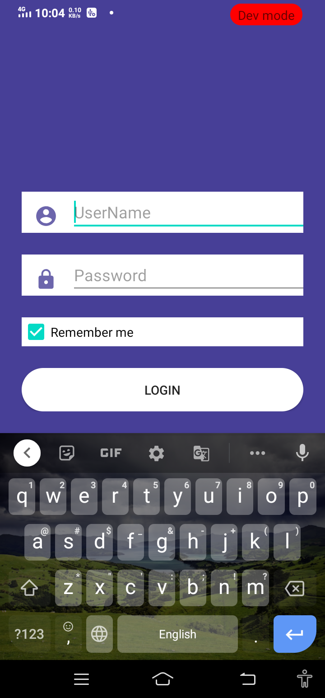
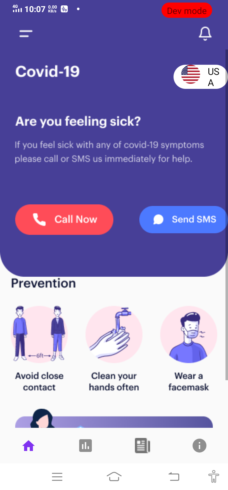
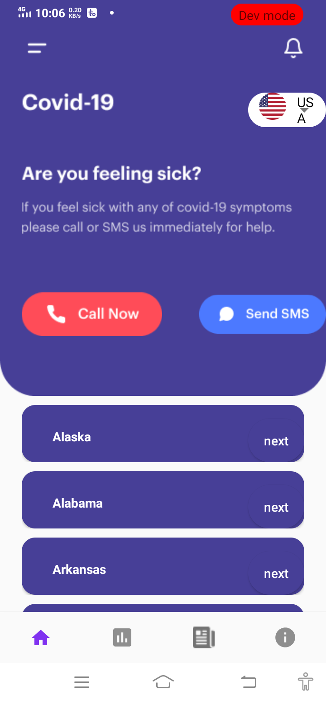
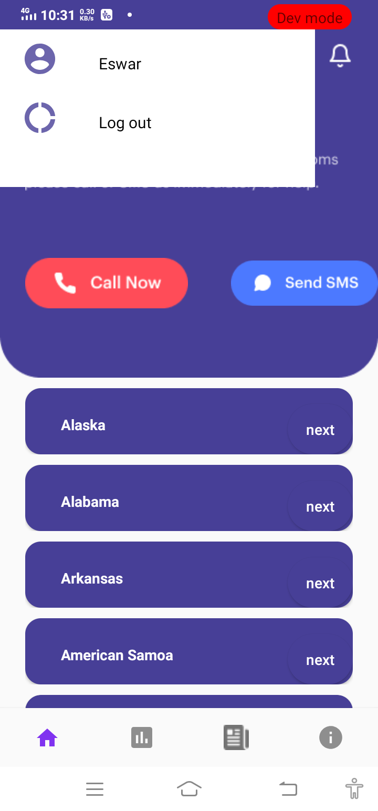
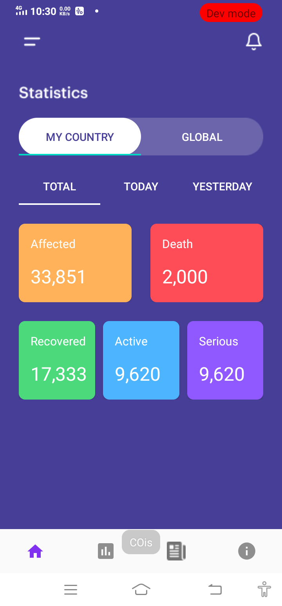

# Covid_19_Tracker
 * Covid_19 Tracker app which gives information about deaths,affected,active,recovered and serious count of covid_patients of particular state of USA.
 * It monitors data of each category and of covid patientsand  displays it.

### Features :
* Covid Helpline number calling facility.
* User can log out from the app.
* Selects particular state of USA.
* Dispalyas that particular state particular assignments.

 
 ### Android Tools and Components used :
   
   * Android Tools          : Android Studio
   * Android Components     : Activities and Intents
   * Additional Components   : RecycyclerView, Fragments
   * Architecture           : MVVM(Architectural Components : Livadata,View Model)
   * Database               : Roomdatase(Library),Shared Preferences
   * API                    : Retrofit for Api calling
 
 ### Screenshots and Discription :
 
   

Splash Activity and User Login activity.If once the user login agai when open the app it will automatically naviagte to the home activity and hides the login     screen.

   
 
Home Activity having Bottom navigation bar along with four fragments each frag,ment displays a particular details here home fragment dispalys some information   once we select the country as USA then it will displays the list of all states of USA.Once we click on particular state it navigates to statistics fragment which has two fragments in it.Here Country fragment having again three fragments today ,total and yesterday fragments.

 

Total,Today and Yesterday fragments displays the deaths,active, recovered and serious counts of covid patients of that particular state that we want to know.

 

    
   
  

