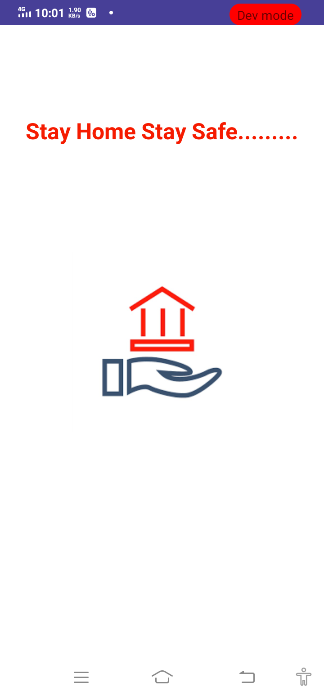

# Covid_19_Tracker

 * Covid_19 Tracker app which gives information about deaths,affected,active,recovered and serious count of covid_patients of particular state of USA.
 * It monitors data of each category and of covid patientsand  displays it.
 * Android Tools and Components used :
   
   * Android Tools          : Android Studio
   * Android Components     : Activities and Intents
   * Additional Components   : RecycyclerView, Fragments
   * Architecture           : MVVM(Architectural Components : Livadata,View Model)
   * Database               : Roomdatase
   * API                    : Retrofit for Api calling
    
   
  

